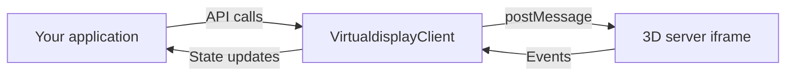
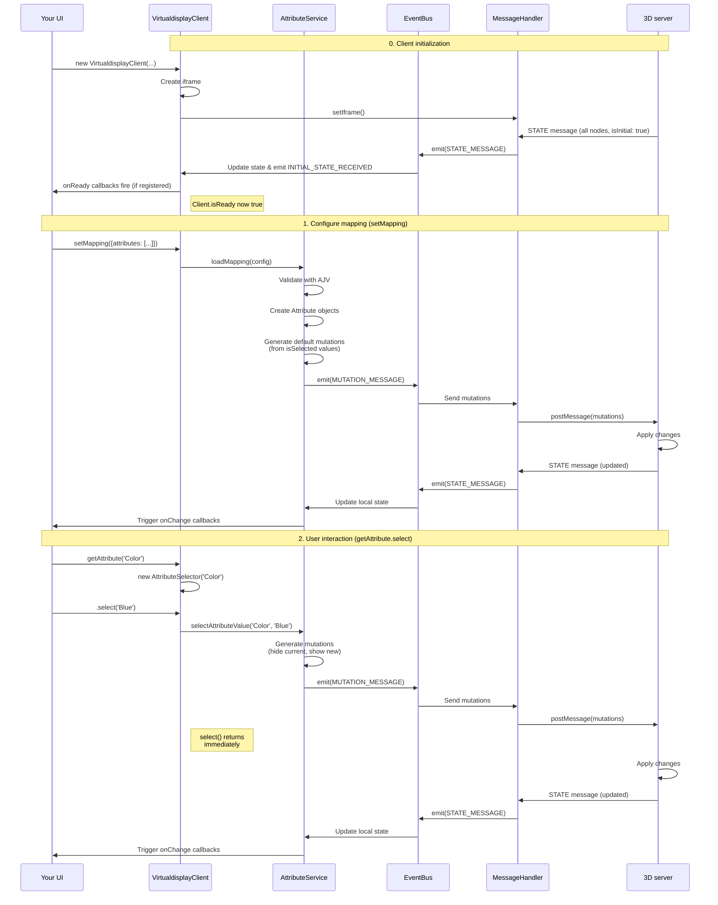

# Virtualdisplay client

TypeScript library for embedding interactive 3D product models in web
applications.

**Key features:**

- Simple attribute-based API for product configurators
- Fire-and-forget messaging with automatic state synchronization
- Zero external dependencies (all bundled)
- Works with any frontend framework or vanilla JavaScript

## Installation

```bash
npm install @virtualdisplay.io/client
# or
pnpm add @virtualdisplay.io/client
# or
yarn add @virtualdisplay.io/client
```

## Quick start

### Simple product (no options)

```typescript
import { VirtualdisplayClient } from '@virtualdisplay.io/client';

// That's it! Your 3D model is now displayed
const client = new VirtualdisplayClient({
  parent: '#product-container',
  license: 'your-license-key',
  model: 'statue-model',
});
```

### Configurable product (with options)

```typescript
import { VirtualdisplayClient } from '@virtualdisplay.io/client';

// Create client instance
const client = new VirtualdisplayClient({
  parent: '#product-container',
  license: 'your-license-key',
  model: 'sneaker',
});

// Map product options to 3D parts
client.setMapping({
  attributes: [
    {
      name: 'Color',
      values: [
        { value: 'Red', nodeIds: ['laces_red', 'sole_red'], isSelected: true },
        { value: 'Blue', nodeIds: ['laces_blue', 'sole_blue'] },
      ],
    },
  ],
});

// Control via product options
client.getAttribute('Color')?.select('Red');

// Or store the attribute for multiple operations
const sizeAttribute = client.getAttribute('Size');
if (sizeAttribute) {
  sizeAttribute.select('Large');
}
```

## How it works

The 3D server hosts the viewer in an iframe, keeping WebGL complexity isolated
from your application. The client library handles all communication via
postMessage and manages state locally using an attribute mapping system.



**Key principles:**

- **Iframe architecture**: 3D server loads the viewer independently
- **Fire-and-forget**: Send messages without waiting for confirmation
- **Attribute mapping**: Connect your product options to 3D model parts
- **State synchronization**: Client and 3D server stay in sync automatically
- **Domain-driven design**: Clean separation of concerns with simplified
  architecture
- **Event-driven**: Loosely coupled components communicate via events

## Product options

### When do you need mapping

Before diving in, it's important to understand when you need attribute mapping:

**No mapping needed:**

- Static 3D models that always look the same
- Product showcases without options
- Architectural visualizations
- Art pieces or sculptures
- Single-configuration products

**Mapping required:**

- Products where users can change colors (different textures/materials per option)
- Products with size options (different 3D meshes per size)
- Modular products (parts that can be added/removed)
- Any product where different options show different 3D elements

### Attribute mapping

The mapping system bridges your business logic with the 3D visualization. It
serves multiple purposes:

**Why mapping is essential:**

- The 3D server is generic - it doesn't know your specific product options
- Your business rules (stock, pricing, combinations) change independently from
  the 3D model
- You control exactly which parts of the model are shown for each option
- You can group multiple 3D nodes (meshes, materials) into logical product
  choices

**How it works:** The mapping connects your product options to specific parts of
the 3D model:

```typescript
client.setMapping({
  attributes: [
    {
      name: 'Color',
      values: [
        {
          value: 'Red',
          nodeIds: ['mat_red_sole', 'mat_red_laces', 'mat_red_logo'],
          isSelected: true,
        },
        {
          value: 'Blue',
          nodeIds: ['mat_blue_sole', 'mat_blue_laces', 'mat_blue_logo'],
        },
      ],
    },
    {
      name: 'Material',
      values: [
        { value: 'Leather', nodeIds: ['material_leather_upper'] },
        {
          value: 'Canvas',
          nodeIds: ['material_canvas_upper'],
          isSelected: true,
        },
      ],
    },
  ],
});
```

**Structure explained:**

- `attribute` - A product feature like Color, Size, or Material
- `value` - A specific option like Red, Blue, Small, or Large
- `nodeIds` - The 3D model parts that represent this option
- `isSelected` - Whether this option is selected by default

**Example benefits:**

```typescript
// Group related 3D parts into one logical choice
{
  value: 'Red',
  nodeIds: [
    'mesh_sole_red',      // Red sole mesh
    'material_laces_red', // Red laces material
    'texture_logo_red',   // Red logo texture
    'mesh_stitching_red'  // Red stitching details
  ]
}

// The server automatically handles showing Red parts
// and hiding Blue/Green parts when Red is selected
```

**Key advantages:**

- Full control over what's visible without modifying the 3D model
- Business logic stays in your application, not in the 3D server
- Easy to update when products or availability changes
- Group complex 3D structures into simple user choices

**Need help with mapping?**

- We help you connect your product catalog to your 3D models
- Visual mapping tool coming soon to simplify this process
- Contact <support@virtualdisplay.io> for mapping assistance

### Complete flow

Here's how the client, mapping system, and 3D server work together:



**Phase by phase breakdown:**

#### Phase 0: Initialization (always happens)

- Client creates iframe and loads 3D server
- Server initializes the 3D model with all nodes visible
- Server sends complete node state to client (with `isInitial: true`)
- Client updates state and becomes ready (`client.isReady = true`)
- Any registered `onReady` callbacks fire
- Client now knows about all available nodes in the model

**Note:** For simple models without options, this is all you need!

#### Phase 1: Configuration (only for configurable products)

- You call `setMapping()` with your product structure
- Client stores the attribute mapping locally
- Client sends mutations for all `isSelected: true` values
- Server applies these changes and hides non-selected options
- Server sends back confirmed state
- Local state updates based on server response
- onChange callbacks fire for initial UI synchronization

#### Phase 2: User interaction (only for configurable products)

- User selects a different option in your UI
- You call `getAttribute('Color').select('Blue')`
- Client sends mutation request to server
- Your code continues immediately (doesn't wait for server response)
- Server updates the 3D model
- Server sends back the confirmed state
- Local state updates based on server response
- onChange callbacks fire with the actual state
- UI stays perfectly synchronized with 3D model

**Important:** The pattern is identical for both initial mapping and user
interactions. In both cases:

1. Client sends mutations to server
2. Server applies changes to 3D model
3. Server sends back confirmed state
4. Client updates local state based on server response
5. onChange callbacks fire with the actual state

This ensures the server remains the single source of truth for all state
changes.

## Advanced usage

### Live state synchronization

Keep your UI in sync with the 3D server state using onChange callbacks:

```typescript
const colorAttribute = client.getAttribute('Color');

colorAttribute?.getValues().forEach((value) => {
  value.onChange = () => {
    // Update UI when state changes
    updateButton(value.value, value.isSelected);
  };
});
```

### Mapping validation

Validate your mapping configuration during development:

```typescript
import { mappingSchema } from '@virtualdisplay.io/client';
import Ajv from 'ajv';

const validate = new Ajv().compile(mappingSchema);
if (!validate(myMapping)) {
  console.error('Invalid mapping:', validate.errors);
}
```

## Real-world integration examples

### CMS integration

The Virtualdisplay client is CMS-agnostic. Store the mapping configuration in
your CMS alongside your product data:

```typescript
// Fetch product with 3D mapping from your CMS
const product = await fetch('/api/products/sneaker-pro').then((r) => r.json());

// Use the stored mapping directly
client.setMapping(product.server3dMapping);
```

**Best practices:**

- Store the complete mapping configuration with each product
- Update mappings when product options or availability changes
- Let your CMS handle filtering of unavailable combinations
- Version your mappings when 3D models are updated

## Examples

Check out our example implementations:

- [Color configurator](./examples/color-configurator/) - Product configurator with attribute mapping
- [Camera controls](./examples/camera-controls/) - Interactive camera positioning demo
- [Snapshot demo](./examples/snapshot-demo/) - Capturing product images programmatically
- [Static model](./examples/static-model/) - Simple viewer without configuration

Each example demonstrates different aspects of the API with complete working code.

## API reference

### ClientOptions

```typescript
interface ClientOptions {
  parent: string | HTMLElement; // Where to embed the 3D viewer
  license: string; // License key from your Virtualdisplay account
  model: string; // Which 3D model to load
  debug?: boolean; // Shows console logs for troubleshooting
  language?: string; // UI language: 'nl', 'en', or 'de' (default: 'nl')

  // UI elements (all visible by default)
  ui?: {
    arEnabled?: boolean;
    fullscreenEnabled?: boolean;
    loadingIndicatorEnabled?: boolean;
  };

  // Camera behavior
  camera?: {
    initialRotate?: number; // Starting view angle (-180 to 180, 0 = front)
    initialTilt?: number; // Starting elevation (0 = top view, 90 = side view)
    initialZoom?: number; // Starting distance (100 = default, may need adjustment)
    minZoom?: number; // Minimum zoom level constraint
    maxZoom?: number; // Maximum zoom level constraint
    minTilt?: number; // Minimum tilt angle constraint
    maxTilt?: number; // Maximum tilt angle constraint
  };
}
```

### Methods

#### `setMapping(configuration: MappingConfiguration): void`

Configure attribute-to-node mapping for product variants. This is the primary
method for setting up your product configurator. Call this once with your
complete configuration - the client efficiently handles all updates.

```typescript
client.setMapping({
  attributes: [
    {
      name: 'Color',
      values: [
        { value: 'Red', nodeIds: ['node1', 'node2'], isSelected: true },
        { value: 'Blue', nodeIds: ['node3', 'node4'] },
      ],
    },
  ],
});
```

#### `getAttribute(name: string): AttributeSelector | undefined`

Get an attribute selector for changing values. Returns undefined if the
attribute doesn't exist.

```typescript
const colorAttr = client.getAttribute('Color');
if (colorAttr) {
  colorAttr.select('Blue');
}
```

#### UI control methods

Control UI elements visibility dynamically through the client:

```typescript
client.viewer.setArEnabled(false);
client.viewer.setFullscreenEnabled(true);
client.viewer.setLoadingIndicatorEnabled(false);
client.viewer.hideAllUI();
client.viewer.showAllUI();
client.viewer.updateUIConfig({ arEnabled: false, fullscreenEnabled: true });
```

#### `camera: Camera`

Control the 3D viewer's camera position programmatically.

```typescript
client.camera.rotate(45).set();
client.camera.rotate(90).tilt(45).zoom(150).set();
client.camera.reset();
```

#### `snapshot.take(filename: string): Photo`

Request a snapshot of the current 3D view. You must provide a filename with a valid image extension
(.png, .jpg, .jpeg, or .webp).

This works perfectly with the camera API - first position the model exactly how you want it, then capture:

```typescript
// Position the model for a perfect product shot
client.camera.rotate(45).tilt(60).zoom(120).set();

// Take a snapshot once positioned
const photo = client.snapshot.take('product-hero-shot.jpg');

// Register callback for when image is ready
photo.onDeveloped((photoData) => {
  // photoData.filename - The filename you provided
  // photoData.data - Base64 encoded image data

  // Use the image
  const img = document.createElement('img');
  img.src = photoData.data;
  document.body.appendChild(img);
});
```

The snapshot captures exactly what the user sees, including selected options and current camera angle.
The image format is determined by the file extension you provide.

#### `destroy(): void`

Clean up and remove the client connection.

```typescript
// When done with the viewer
client.destroy();
```

### Types

```typescript
interface MappingConfiguration {
  attributes: AttributeConfig[];
}

interface AttributeConfig {
  name: string; // Attribute name (e.g., 'Color')
  values: AttributeValueConfig[]; // Possible values
}

interface AttributeValueConfig {
  value: string; // Value name (e.g., 'Red')
  nodeIds: string[]; // 3D node IDs for this value
  isSelected?: boolean; // Default selection state
}

class AttributeSelector {
  // Properties
  name: string; // Attribute name (getter)
  currentValue: string | undefined; // Current selected value (getter)
  availableValues: string[]; // All possible values (getter)

  // Methods
  select(value: string): AttributeSelector; // Select a value (chainable)
  onChange(callback: () => void): AttributeSelector; // Register change callback (chainable)
  getValues(): AttributeValue[]; // Get all AttributeValue objects
  getValue(value: string): AttributeValue | undefined; // Get specific AttributeValue
}

class AttributeValue {
  // Properties
  value: string; // The value name (e.g., 'Red') - getter
  nodeList: string[]; // Associated 3D node IDs - getter
  isSelected: boolean; // Current selection state - getter
  onChange?: () => void; // Callback when selection changes - property
}

class Camera {
  // Methods - all return Camera for chaining
  rotate(degrees: number): Camera; // Rotate horizontally
  tilt(degrees: number): Camera; // Tilt vertically
  zoom(percentage: number): Camera; // Set zoom level
  reset(): void; // Reset to base position (executes immediately)
  set(): void; // Execute chained commands
}

class Snapshot {
  // Methods
  take(): Promise<Photo>; // Capture current view
}

interface Photo {
  dataUri: string; // Base64 data URI
  blob: Blob; // Raw image blob
  filename: string; // Suggested filename
}

class VirtualdisplayViewerService {
  // Methods
  setArEnabled(enabled: boolean): void;
  setFullscreenEnabled(enabled: boolean): void;
  setLoadingIndicatorEnabled(enabled: boolean): void;
  updateUIConfig(config: Partial<UIConfig>): void;
  hideAllUI(): void;
  showAllUI(): void;
}

interface UIConfig {
  arEnabled?: boolean;
  fullscreenEnabled?: boolean;
  loadingIndicatorEnabled?: boolean;
}
```

#### Node manipulation

The client provides methods for direct node access. This is intended
for specialized tools like mapping editors and inspectors, not for typical
product configurators. For product configurators, use the attribute-based API.

```typescript
const node = client.getNode('nodeId'); // Get specific node
const nodes = client.getNodes(); // Get all nodes
const selector = client.getNodeSelector('nodeId'); // Get node selector for manipulation
```

##### Node visibility monitoring

For advanced use cases, you can monitor visibility changes on individual nodes:

```typescript
const node = client.getNode('node1');
if (node) {
  node.onChange = () => {
    console.log(`Node ${node.name} visibility changed to: ${node.isVisible}`);
  };
}
```

This is useful for:

- Mapping tools that need to track which nodes are visible
- Debugging tools that monitor state changes
- Advanced UI that reacts to specific node visibility

**Note:** The `onChange` callback is triggered only when the node's visibility actually changes, not on every state update.

#### Ready state detection

For advanced use cases where you need to know when the initial state sync is complete, the client provides ready state detection:

```typescript
// Check if initial sync is complete
if (client.isReady) {
  console.log('Client has received initial state');
}

// Or wait for ready state
client.onReady(() => {
  console.log('Initial sync complete');
  // Access to all nodes is now guaranteed
});
```

**Important:** Waiting for ready state delays your initial render. For the best user experience with product
configurators, call `setMapping()` immediately - it works without waiting for ready state. This feature is primarily for
specialized tools that need direct node access.

### Error handling

The client throws `VirtualdisplayError` for known error conditions:

```typescript
import {
  VirtualdisplayClient,
  VirtualdisplayError,
  ERROR_CODES,
} from '@virtualdisplay.io/client';

try {
  client.getAttribute('NonExistent').select('Value');
} catch (error) {
  if (error instanceof VirtualdisplayError) {
    switch (error.code) {
      case ERROR_CODES.ATTRIBUTE_NOT_FOUND:
        console.error('Attribute does not exist');
        break;
      case ERROR_CODES.NO_MAPPING:
        console.error('Call setMapping() first');
        break;
      // Handle other error codes
    }
  }
}
```

**Error codes:**

- `NO_MAPPING` - No mapping configuration set
- `ATTRIBUTE_NOT_FOUND` - Requested attribute doesn't exist
- `VALUE_NOT_FOUND` - Requested value doesn't exist for attribute
- `INVALID_MAPPING` - Mapping configuration is invalid
- `PARENT_NOT_FOUND` - Parent element for iframe not found

## Contributing

See [CONTRIBUTING.md](./CONTRIBUTING.md) for development setup and guidelines.

## Troubleshooting

### Common issues

**Iframe not loading:**

- Check that the parent element exists in the DOM
- Verify your license key is valid
- Ensure the model ID matches your license

**Attributes not working:**

- Make sure you call `setMapping()` before using `getAttribute()`
- Verify attribute names match exactly (case-sensitive)
- Check that node IDs in your mapping exist in the 3D model

## Changelog

See the [GitHub releases](https://github.com/virtualdisplay-io/client/releases)
for release notes and version history.
