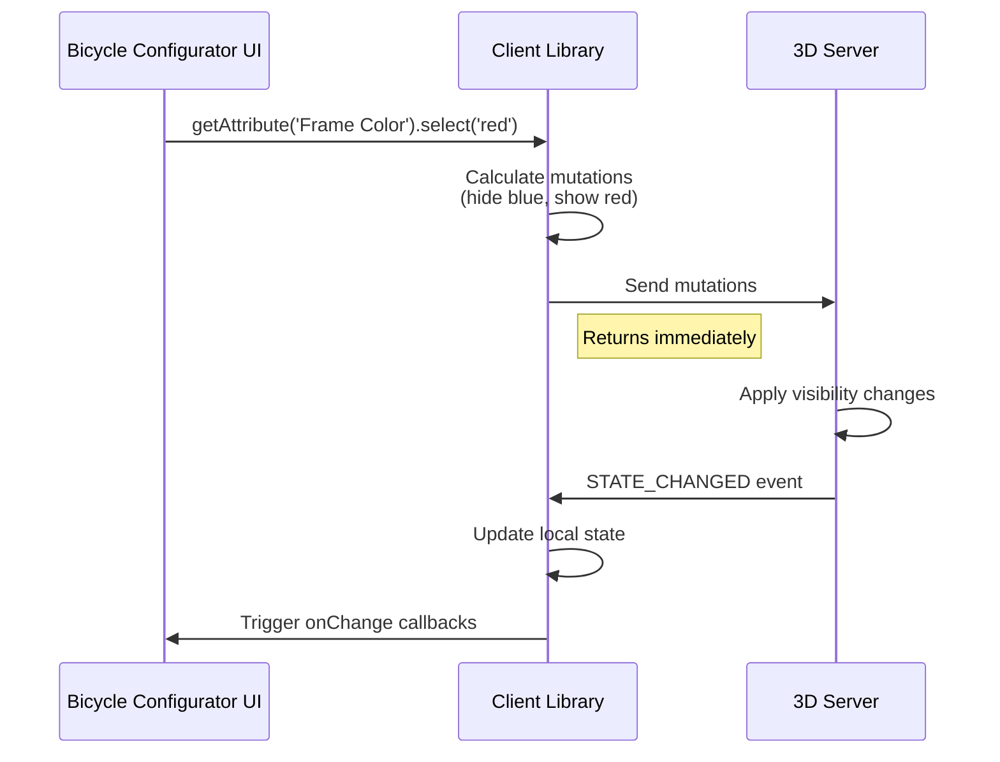

# Understanding attribute mapping

## What is attribute mapping

Attribute mapping is the bridge between your product's business logic and its 3D visualization. It translates
your product options into specific parts of the 3D model that should be visible.

Think of it as a configuration system that connects:

- User selections in your UI (choosing colors, sizes, features)
- What gets displayed in the 3D viewer (specific meshes, materials, and parts)

## Example: City bicycle configurator

To make these concepts concrete, we'll use a city bicycle configurator throughout this documentation.
A typical bicycle has many customizable options, but let's start with the most obvious ones:

- Frame color (blue, red, or black)
- Accessories (adding a basket or lights)
- Saddle type (comfort or sport)

When the user selects "blue frame", the system shows the blue frame mesh and hides the red and black ones.
When they add a basket, the basket accessory becomes visible on the 3D model.

## Why do we use mapping

### The separation of concerns

The 3D server is intentionally generic - it doesn't know anything about your specific products, pricing,
inventory, or business rules. This separation provides several benefits:

1. **Business flexibility**: Update product options, pricing, or availability without touching the 3D model
2. **Reusability**: Use the same 3D server for all your products
3. **Independence**: Your developers work on business logic while 3D artists work on models
4. **Scalability**: Add new product variants without modifying the 3D infrastructure

## Components of mapping

### 1. Attributes

An attribute represents a customizable aspect of your product. For our complete bicycle
configurator, all configurable options are:

- **Frame Color** - The main frame color
- **Frame Size** - Small, Medium, Large
- **Saddle Type** - Comfort or sport
- **Grips** - Brown or black
- **Accessories** - Basket, lights, bell
- **Gear System** - Single speed or 7-speed
- **Wheel Size** - 26" or 28" (depends on frame size in dynamic mapping)

### 2. Node IDs

Node IDs are the names of specific parts in the bicycle's 3D model:

- `frame_blue` - The blue-colored frame mesh
- `frame_red` - The red-colored frame mesh
- `frame_black` - The black-colored frame mesh
- `basket_front` - Front basket accessory
- `lights_front` - Front light
- `lights_rear` - Rear light
- `bell_chrome` - Chrome bell on handlebar
- `saddle_comfort_brown` - Brown comfort saddle
- `saddle_sport_black` - Black sport saddle
- `gears_7speed` - 7-speed gear system parts

These are the actual 3D elements that will be shown or hidden. The 3D artist decides these names when
creating the model, and they cannot be changed. You must use the exact node IDs that exist in the 3D file.

### 3. Values

Each attribute has multiple possible values. For our bicycle:

- **Frame Color**: "blue", "red", "black"
- **Frame Size**: "small", "medium", "large"
- **Accessories**: "none", "basket", "lights", "full" (basket + lights + bell)
- **Saddle Type**: "comfort", "sport"
- **Gear System**: "single", "7-speed"

**The value property:** This is an identifier that connects your UI to the 3D visualization. It can be any
string value - the client library simply uses it to match your selection calls with the mapping configuration.

While you can use any values you want (even made-up ones like "option-a", "variant-1"), it's best practice
to use the same values as your existing e-commerce or product system. This makes integration easier:

```typescript
// Good practice: Match your existing system
{ value: 'blue', nodeIds: ['frame_blue'] }            // Same as product database
{ value: 'SKU-BASKET-01', nodeIds: ['basket_front'] } // Using SKU system

// Also valid: Custom identifiers
{ value: 'primary-color', nodeIds: ['frame_blue'] }   // Custom naming
{ value: 'color-1', nodeIds: ['variant_a'] }          // Made-up values
```

**Connecting to UI elements:** Here's how the value connects your bicycle configurator interface to the 3D model:

```html
<!-- Frame color selection dropdown -->
<select id="frame-color">
  <option value="blue">Ocean Blue</option>
  <option value="red">Cherry Red</option>
  <option value="black">Midnight Black</option>
</select>

<!-- Frame size with radio buttons -->
<input type="radio" name="size" value="small" id="size-s" />
<label for="size-s">Small (150-165cm)</label>
<input type="radio" name="size" value="medium" id="size-m" />
<label for="size-m">Medium (165-180cm)</label>
<input type="radio" name="size" value="large" id="size-l" />
<label for="size-l">Large (180-195cm)</label>

<!-- Accessories with checkboxes -->
<input type="checkbox" id="basket" data-accessory="basket" />
<label for="basket">Front Basket (+€25)</label>
<input type="checkbox" id="lights" data-accessory="lights" />
<label for="lights">LED Lights (+€35)</label>

<script>
  // Frame color dropdown handler
  document.getElementById('frame-color').addEventListener('change', (e) => {
    const selectedColor = e.target.value; // 'blue', 'red', or 'black'
    client.getAttribute('Frame Color').select(selectedColor);
  });

  // Frame size radio button handler
  document.querySelectorAll('input[name="size"]').forEach((radio) => {
    radio.addEventListener('change', (e) => {
      if (e.target.checked) {
        client.getAttribute('Frame Size').select(e.target.value);
      }
    });
  });

  // Accessories checkbox handler
  document.querySelectorAll('[data-accessory]').forEach((checkbox) => {
    checkbox.addEventListener('change', () => {
      // Determine which accessories are selected
      const hasBasket = document.getElementById('basket').checked;
      const hasLights = document.getElementById('lights').checked;

      let accessoryValue = 'none';
      if (hasBasket && hasLights) {
        accessoryValue = 'full';
      } else if (hasBasket) {
        accessoryValue = 'basket';
      } else if (hasLights) {
        accessoryValue = 'lights';
      }

      client.getAttribute('Accessories').select(accessoryValue);
    });
  });
</script>
```

The key is: whatever value you define in your mapping must match what you pass to `select()`.

### 4. Selection state

Each value can be marked as selected or not:

- `isSelected: true` - This option is active by default
- `isSelected: false` or omitted - This option is not active

For our bicycle, we might want:

- Default frame color: Blue (`isSelected: true`)
- Default frame size: Medium (most common)
- Default accessories: None (base model)

## How the mapping process works

### Step 1: Define your mapping structure

Here's a complete mapping for our bicycle configurator:

```typescript
{
  attributes: [
    {
      name: 'Frame Color',
      values: [
        {
          value: 'blue',
          nodeIds: ['frame_blue'],
          isSelected: true, // Default color
        },
        {
          value: 'red',
          nodeIds: ['frame_red'],
        },
        {
          value: 'black',
          nodeIds: ['frame_black'],
        },
      ],
    },
    {
      name: 'Saddle Type',
      values: [
        {
          value: 'comfort',
          nodeIds: ['saddle_comfort_brown'],
          isSelected: true, // Default saddle
        },
        {
          value: 'sport',
          nodeIds: ['saddle_sport_black'],
        },
      ],
    },
    {
      name: 'Accessories',
      values: [
        {
          value: 'none',
          nodeIds: [], // No accessories visible
          isSelected: true,
        },
        {
          value: 'basket',
          nodeIds: ['basket_front'],
        },
        {
          value: 'lights',
          nodeIds: ['lights_front', 'lights_rear'],
        },
        {
          value: 'full',
          nodeIds: [
            'basket_front',
            'lights_front',
            'lights_rear',
            'bell_chrome',
          ],
        },
      ],
    },
  ];
}
```

### Step 2: Client processes the mapping

When you call `client.setMapping()`:

1. **Validation**: The configuration is validated for correctness
2. **Storage**: The mapping is stored locally in the client
3. **Initial mutations**: The client calculates which nodes should be visible based on `isSelected`
   - Shows: `frame_blue`, `saddle_comfort_brown`
   - Hides: All red and black frames, sport saddle, all accessories
4. **Message to server**: These visibility changes are sent to the 3D server

### Step 3: Server applies the changes

The 3D server:

1. Receives the visibility instructions
2. Shows/hides the appropriate bicycle parts
3. Sends back confirmation of the current state

### Step 4: User interactions

When a user customizes their bicycle:

1. User selects "Red" frame color from dropdown
2. Your code calls `client.getAttribute('Frame Color').select('red')`
3. Client calculates what needs to change:
   - Hide: `frame_blue`
   - Show: `frame_red`
4. These mutations are sent to the server
5. Server updates the 3D bicycle model and confirms the new state



## Key principles

### 1. Server is the source of truth

The client sends mutation requests, but the server determines the actual state. Only the server knows which
nodes really exist in the 3D model. The client's state is updated only after receiving the STATE_CHANGED event
from the server.

### 2. Fire and forget

When you call `select()`, the method returns immediately without waiting for server confirmation. Your code can
continue, but the actual state update happens asynchronously when the server responds.

### 3. Declarative configuration

You describe what should be visible for each option, not how to transition between states.
The system handles the complexity.

### 4. Grouping for simplicity

Multiple 3D nodes can be grouped under one user-facing option. Users see "Full Package" while the system manages
multiple accessory parts (`basket_front`, `lights_front`, `lights_rear`, `bell_chrome`).

**Example benefits:**

```typescript
// Group related 3D parts into one logical choice
{
  value: 'Red',
  nodeIds: [
    'frame_red',        // Red frame mesh
    'fenders_red',      // Red fenders material
    'chain_guard_red',  // Red chain guard texture
    'grips_red'         // Red grip details
  ]
}

// The server automatically handles showing Red parts
// and hiding Blue/Black parts when Red is selected
```

## When do you need mapping

### You need mapping when

- **Products with color/material variations**: Different textures or materials per option
- **Products with size options**: Different 3D meshes or positioning per size
- **Modular products**: Parts that can be added, removed, or swapped
- **Optional features**: Accessories, upgrades, or add-ons
- **Any scenario where user choices affect what's visible in 3D**

### You don't need mapping when

- **Static 3D models**: Always look the same regardless of user interaction
- **Product showcases**: Pure visualization without configuration options
- **Architectural visualizations**: Static buildings or environments
- **Art pieces or sculptures**: Single-configuration display items
- **Single-variant products**: No customization options available

## Why mapping is essential

**Separation of concerns:**

- The 3D server is generic - it doesn't know your specific product options
- Your business rules (stock, pricing, combinations) change independently from the 3D model
- You control exactly which parts of the model are shown for each option
- You can group multiple 3D nodes (meshes, materials) into logical product choices

**Key advantages:**

- Full control over what's visible without modifying the 3D model
- Business logic stays in your application, not in the 3D server
- Easy to update when products or availability changes
- Group complex 3D structures into simple user choices

## Need help with mapping

- We help you connect your product catalog to your 3D models
- Visual mapping tool coming soon to simplify this process
- Contact <support@virtualdisplay.io> for mapping assistance

## Next steps

- See [Static Mapping Examples](./static-mapping-examples.md) for simple, independent options
- See [Dynamic Mapping Examples](./dynamic-mapping-examples.md) for options with dependencies
- Check the main [README](../README.md) for API reference
